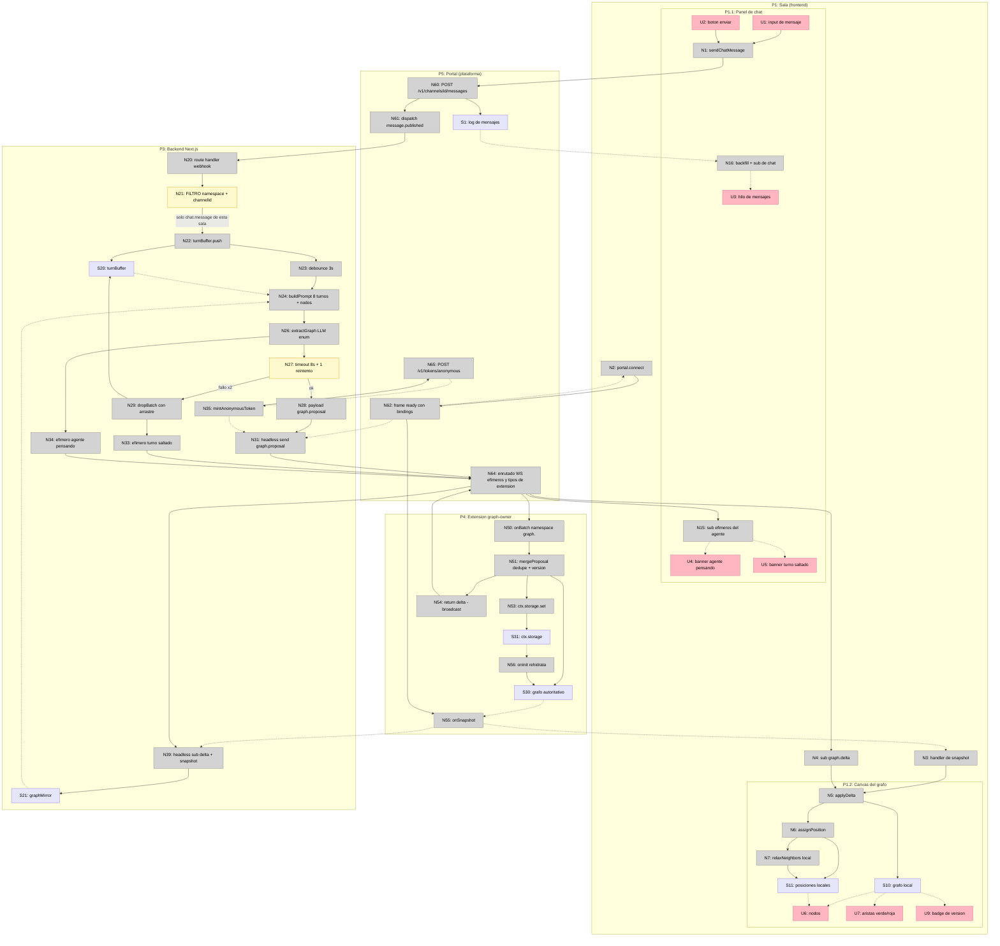
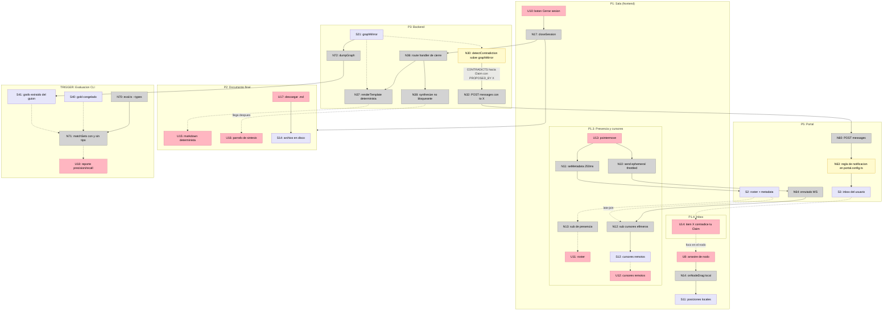

# Breadboard de la shape C — Lienzo colaborativo con grafo en vivo

Detalle de afordances de la shape **C** (`shaping.md`), con C3.4 resuelto por **C3.4-B** (cliente headless `@portalsdk/core` sobre WS).

Las **tablas son la verdad**. Los diagramas Mermaid son visualización.

Sistemas que atraviesa un solo breadboard: cliente Next.js · backend Next.js · channel extension de Portal · plataforma Portal · CLI de evaluación.

---

## Places

| # | Place | Descripción |
|---|-------|-------------|
| P1 | Sala (frontend Next.js) | La página del lienzo. Todo el journey del participante ocurre aquí |
| P1.1 | Panel de chat | Subplace: entrada de texto, hilo de mensajes, banners efímeros del agente |
| P1.2 | Canvas del grafo | Subplace: nodos, aristas, arrastre, badge de versión |
| P1.3 | Presencia y cursores | Subplace: roster y punteros remotos |
| P1.4 | Inbox | Subplace: items de notificación dirigida |
| P2 | Documento final (modal) | Se abre al cerrar la sesión. Bloquea la sala: es un Place |
| P3 | Backend Next.js | Route handlers del webhook y del cierre + cliente headless de Portal |
| P4 | Channel extension `graph-owner` | Dueña del grafo autoritativo |
| P5 | Portal (plataforma) | Canal, log de mensajes, presencia, enrutado WS, webhooks, inbox |
| P6 | Evaluación (TRIGGER: CLI) | Script offline contra el gold anotado |

---

## UI Affordances

| # | Place | Componente | Afordance | Control | Wires Out | Returns To |
|---|-------|------------|-----------|---------|-----------|------------|
| U1 | P1.1 | `chat-panel` | input de mensaje | type | → N1 | — |
| U2 | P1.1 | `chat-panel` | botón enviar / Enter | click | → N1 | — |
| U3 | P1.1 | `chat-panel` | hilo de mensajes | render | — | — |
| U4 | P1.1 | `chat-panel` | banner "el agente está pensando" | render | — | — |
| U5 | P1.1 | `chat-panel` | banner "el agente se saltó un turno" | render | — | — |
| U6 | P1.2 | `graph-canvas` | nodos del grafo | render | — | — |
| U7 | P1.2 | `graph-canvas` | aristas `SUPPORTS` verde / `CONTRADICTS` roja | render | — | — |
| U8 | P1.2 | `graph-canvas` | arrastre de nodo | drag | → N14 | — |
| U9 | P1.2 | `graph-canvas` | badge de versión del grafo | render | — | — |
| U10 | P1 | `room-page` | botón "Cerrar sesión" | click | → N17 | — |
| U11 | P1.3 | `presence-bar` | roster de participantes | render | — | — |
| U12 | P1.3 | `cursor-layer` | cursores remotos | render | — | — |
| U13 | P1.3 | `cursor-layer` | movimiento del puntero | pointermove | → N10, → N11 | — |
| U14 | P1.4 | Portal inbox | item "X contradice tu Claim" | render / click | → P1.2 | — |
| U15 | P2 | `session-doc` | markdown determinista | render | — | — |
| U16 | P2 | `session-doc` | párrafo de síntesis | render | — | — |
| U17 | P2 | `session-doc` | botón descargar `.md` | click | → S14 | — |
| U18 | P6 | `eval.ts` | reporte precisión/recall (con y sin tipo) | render | — | — |

---

## Code Affordances

### P1 — Cliente (frontend Next.js)

| # | Place | Componente | Afordance | Control | Wires Out | Returns To |
|---|-------|------------|-----------|---------|-----------|------------|
| N1 | P1.1 | `chat-panel` | `sendChatMessage()` | call | → N60 | — |
| N2 | P1 | `portal-client` | `portal.connect()` | call | → N62 | — |
| N3 | P1 | `portal-client` | handler del snapshot en la trama de conexión | observe | → N5 | — |
| N4 | P1 | `portal-client` | suscripción a `graph.delta` | observe | → N5 | — |
| N5 | P1.2 | `graph-store` | `applyDelta()` | call | → S10, → N6 | — |
| N6 | P1.2 | `layout` | `assignPosition(node)` — fija al crear | call | → S11, → N7 | — |
| N7 | P1.2 | `layout` | `relaxNeighbors()` — force-directed solo local | call | → S11 | — |
| N10 | P1.3 | `cursor-layer` | `send({ ephemeral: true })` en pointermove, throttled | call | → N64 | — |
| N11 | P1.3 | `cursor-layer` | `setMetadata()` throttled 250 ms (fallback late-join) | call | → S2 | — |
| N12 | P1.3 | `cursor-layer` | suscripción a cursores efímeros | observe | → S12 | — |
| N13 | P1.3 | `presence-bar` | suscripción de presencia | observe | — | → U11 |
| N14 | P1.2 | `graph-canvas` | `onNodeDrag()` — estado puramente local, no sincronizado | call | → S11 | — |
| N15 | P1.1 | `chat-panel` | suscripción a efímeros del agente | observe | — | → U4, → U5 |
| N16 | P1.1 | `chat-panel` | backfill de historial + suscripción de chat | observe | — | → U3 |
| N17 | P1 | `room-page` | `closeSession()` | call | → N36, → P2 | — |

### P3 — Backend Next.js

| # | Place | Componente | Afordance | Control | Wires Out | Returns To |
|---|-------|------------|-----------|---------|-----------|------------|
| N20 | P3 | `app/api/portal/webhook` | route handler `message.published` | call | → N21 | — |
| N21 | P3 | `app/api/portal/webhook` | **filtro por namespace + `channelId`, primera línea** | conditional | → N22 | — |
| N22 | P3 | `turn-buffer` | `turnBuffer.push(turn)` | write | → S20, → N23 | — |
| N23 | P3 | `turn-buffer` | `debounce(3000)` | call | → N24 | — |
| N24 | P3 | `extractor` | `buildPrompt()` — ventana 8 turnos + lista completa de nodos + guard de idioma | call | → N26 | — |
| N26 | P3 | `extractor` | `extractGraph()` — LLM, structured output con `enum` sobre 6+6 tipos | call | → N27, → N34 | — |
| N27 | P3 | `extractor` | timeout duro 8 s + 1 reintento | conditional | → N28 (ok), → N29 (fallo) | — |
| N28 | P3 | `extractor` | payload `graph.proposal` | call | → N30, → N31 | — |
| N29 | P3 | `turn-buffer` | `dropBatch()` — descarta el lote y arrastra el turno a la ventana siguiente | call | → S20, → N33 | — |
| N30 | P3 | `contradiction` | `detectContradiction()` sobre la lista de nodos ya en contexto | conditional | → N32 | — |
| N31 | P3 | `portal-headless` | cliente headless: `send({ type: 'graph.proposal' })` por WS | call | → N64 | — |
| N32 | P3 | `contradiction` | `POST /v1/channels/{id}/messages` con `to: X` | call | → N60 | — |
| N33 | P3 | `agent-status` | efímero "el agente se saltó un turno" | call | → N64 | — |
| N34 | P3 | `agent-status` | efímero "el agente está pensando" | call | → N64 | — |
| N35 | P3 | `portal-headless` | `mintAnonymousToken()` — `POST /v1/tokens/anonymous` con la `pk_` | call | → N65 | → N31 |
| N36 | P3 | `app/api/session/close` | route handler de cierre | call | → N37, → N38 | — |
| N37 | P3 | `doc-builder` | `renderTemplate(graph)` — plantilla determinista | call | — | → U15 |
| N38 | P3 | `doc-builder` | `synthesize()` — modelo grande, **no bloqueante** | call | — | → U16 |
| N39 | P3 | `portal-headless` | suscripción a `graph.delta` + snapshot del headless | observe | → S21 | — |

### P4 — Channel extension `graph-owner`

| # | Place | Componente | Afordance | Control | Wires Out | Returns To |
|---|-------|------------|-----------|---------|-----------|------------|
| N50 | P4 | `graph-owner` | `onBatch()` sobre el namespace `graph.` | observe | → N51 | — |
| N51 | P4 | `graph-owner` | `mergeProposal()` — dedupe por nombre normalizado, versión incremental | call | → S30, → N53, → N54 | — |
| N53 | P4 | `graph-owner` | `ctx.storage.set('graph', ...)` | call | → S31 | — |
| N54 | P4 | `graph-owner` | `return delta` de `onBatch` → broadcast | call | → N64 | — |
| N55 | P4 | `graph-owner` | `onSnapshot()` | call | — | → N3, → N39 |
| N56 | P4 | `graph-owner` | `onInit()` — rehidrata desde `ctx.storage` | lifecycle | → S30 | — |

### P5 — Portal (plataforma)

| # | Place | Componente | Afordance | Control | Wires Out | Returns To |
|---|-------|------------|-----------|---------|-----------|------------|
| N60 | P5 | REST | `POST /v1/channels/{id}/messages` | call | → S1, → N61, → N63 | — |
| N61 | P5 | webhooks | dispatch `message.published` | call | → N20 | — |
| N62 | P5 | realtime | frame `ready` con la routing table `bindings` | call | → N55 | → N2, → N31 |
| N63 | P5 | `portal.config.ts` | regla de notificación → descriptor de inbox | conditional | → S3 | — |
| N64 | P5 | realtime | enrutado de frames WS: efímeros y tipos de extensión | call | → N50, → N4, → N12, → N15, → N39 | — |
| N65 | P5 | REST | `POST /v1/tokens/anonymous` | call | — | → N35 |

### P6 — Evaluación (CLI)

| # | Place | Componente | Afordance | Control | Wires Out | Returns To |
|---|-------|------------|-----------|---------|-----------|------------|
| N70 | P6 | `eval.ts` | `eval.ts --types=<lista>` | invoke | → N71 | — |
| N71 | P6 | `eval.ts` | `matchSets()` — normalizado por conjuntos, con y sin tipo | call | — | → U18 |
| N72 | P6 | `dump.ts` | `dumpGraph()` del grafo extraído del guion | call | → S41 | — |

---

## Data Stores

| # | Place | Store | Descripción | Returns To (quién lee) |
|---|-------|-------|-------------|------------------------|
| S1 | P5 | log de mensajes del canal | Chat persistente | → N16 |
| S2 | P5 | roster de presencia + `metadata` | Quién está + último cursor conocido (fallback late-join) | → N13, → N12 |
| S3 | P5 | inbox del usuario | Items de notificación dirigida | → U14 |
| S10 | P1.2 | grafo local del cliente | Nodos, aristas, versión | → U6, → U7, → U9 |
| S11 | P1.2 | posiciones de nodos | Local, **no sincronizado** | → U6 |
| S12 | P1.3 | cursores remotos | Efímeros, TTL corto | → U12 |
| S14 | P2 | archivo `.md` en disco del usuario | Store externo (descarga) | — |
| S20 | P3 | `turnBuffer` | Ventana de turnos + arrastre de los descartados | → N24 |
| S21 | P3 | `graphMirror` | Lista completa de nodos, alimentada por los deltas del headless | → N24, → N30, → N37, → N72 |
| S30 | P4 | grafo autoritativo en memoria | Nodos, aristas, versión | → N51, → N54, → N55 |
| S31 | P4 | `ctx.storage` | Sobrevive al reciclaje de instancia | → N56 |
| S40 | P6 | gold anotado (congelado) | Referencia manual | → N71 |
| S41 | P6 | grafo extraído del guion | Salida del pipeline sobre el guion de ~40 turnos | → N71 |

---

## Diagrama 1 — Camino crítico (R0, R1, R2, R4)

**Lo que hay que leer en este diagrama:**

- **N21 es el corte del bucle.** El backend es ahora un participante del canal (N31) y la extensión emite broadcasts. Sin el filtro en la primera línea, el webhook se auto-alimenta con `graph.proposal` y `graph.delta`.
- **N39 cierra el lazo del prompt.** La lista de nodos que va en el prompt (S21) **no** la construye el backend con sus propias propuestas: la recibe del `graph.delta` autoritativo. Si esto no se cablea, el prompt deriva respecto a la verdad y el dedupe de N51 empieza a hacer todo el trabajo.
- **El presupuesto de R1.** `N23` se come 3 s de los 5 s p95. Quedan ~2 s para LLM + merge + broadcast + render. El timeout de 8 s de N27 está *por encima* del presupuesto: cuando el LLM tarda, ese mensaje ya no cumple R1 y sale por la rama de fallo. Es la decisión correcta (mejor tarde y vivo que mudo) pero hay que medirlo aparte.

---

## Diagrama 2 — Flujos periféricos (R5, R6, R3)

---

## Slicing

9 slices. Cada una tiene demo. El orden respeta R7: **V1 y V2 son secuenciales y de todos**; a partir de V3 se abre en tres frentes.

| # | Slice | Parts | Afordances que añade | Demo |
|---|-------|-------|----------------------|------|
| **V1** | Sala viva | C1.1, C1.2, C9.1 | U1, U2, U3, U11 · N1, N2, N13, N16, N60, N62 · S1, S2 | "Tres pestañas en Railway, se chatean, se ven en el roster" |
| **V2** | Delta falso end-to-end | C2.1, C2.4, C3.4-B | U6, U7 · N4, N5, N31, N35, N50, N54, N64, N65 · S10 | "Escribo `/spawn` y aparece el mismo nodo en las tres pantallas" — la extensión devuelve un delta hardcodeado, sin LLM |
| **V3** | Extractor real | C3.1, C3.2, C3.3 | N20, N21, N22, N23, N24, N26, N28, N39, N61 · S20, S21 | "Hablo de verdad durante un minuto y aparecen nodos reales tipados" |
| **V4** | Grafo autoritativo y late-join | C2.2, C2.3, C2.5 | U9 · N3, N51, N53, N55, N56 · S30, S31 | "Entro a mitad de sesión y veo todo. Reciclo la instancia y el grafo sobrevive. Digo dos veces lo mismo y sale un solo nodo" |
| **V5** | Política de fallo del LLM | C4.1, C4.2, C4.3 | U4, U5 · N15, N27, N29, N33, N34 | "Apunto el extractor a una URL muerta: la sala sigue viva, lo dice, y el turno descartado reaparece en el lote siguiente" |
| **V6** | Render de exploración | C5.1, C5.2, C5.3 | U8 · N6, N7, N14 · S11 | "40 nodos legibles, no saltan al llegar el delta 41, arrastro uno y solo se mueve para mí" |
| **V7** | Cursores en vivo | C1.3 | U12, U13 · N10, N11, N12 · S12 | "Veo el puntero de los otros dos, y al abrir una cuarta pestaña también" |
| **V8** | Contradicción → inbox | C6.1, C6.2 | U14 · N30, N32, N63 · S3 | "Contradigo el Claim de otro y le llega una notificación dirigida" |
| **V9** | Cierre: documento + evaluación | C7.1, C7.2, C8.1, C8.2 | U10, U15, U16, U17, U18 · N17, N36, N37, N38, N70, N71, N72 · S14, S40, S41 | "Cierro y sale el markdown al instante; el párrafo se inserta arriba unos segundos después. Y: corro el guion, sale P/R con y sin tipo" |

### Congelaciones que caen sobre el slicing

- **El shape de `graph.delta` se congela al terminar V2** — no a los 30 min por reloj, sino cuando V2 pinta un nodo falso. Ese es el evento que desbloquea el paralelismo (`goal.md`).
- **Los tipos se congelan antes de anotar**, o sea antes de V9-eval, pero afectan a N26 (V3). El de evaluación necesita la lista de tipos antes de que backend escriba el esquema.
- **Feature freeze 3 h antes del deadline.** V7 y V8 son los candidatos a caer: son los que más cargan R5 pero ninguno bloquea (a)/(b)/(c).

### Reparto (R7)

| Persona | Slices |
|---------|--------|
| Canvas / render | V2 (lado cliente), V6, V7 |
| Backend / extensión | V3, V4, V5, V8, V9-documento |
| Guion / anotación / eval | gold (S40) desde la hora 0, V9-eval |

V1 lo montan los tres juntos: es la sala compartida sobre la que los tres van a probar todo.

---

## Preguntas que levanta el breadboard

Ninguna bloquea empezar. Todas cambian una decisión concreta.

1. **¿Quién asigna la posición de un nodo?** C5.1 dice "posición fija al crear", y N6 la calcula **en el cliente** (S11 es local). Con tres participantes eso da tres layouts distintos del mismo grafo — R1 se cumple en el dato, no en la percepción, y en la demo se nota. Sale gratis arreglarlo: sembrar la posición de forma determinista desde el `id` del nodo, en vez de desde el orden de llegada. Decidirlo antes de V6.

2. **El documento final lee S21 (el espejo del backend), no S30 (el grafo autoritativo).** Si el espejo perdió un delta, el documento miente y no hay forma de saberlo. Barato: pedir un `onSnapshot` fresco en N36 antes de N37. Decidirlo en V9.

3. **¿El webhook `message.published` dispara también para los broadcasts de la extensión y para los tipos de extensión?** No lo sabemos. N21 protege en ambos casos, así que no bloquea — pero si dispara, el volumen del webhook se duplica y conviene saberlo antes de medir la p95.

4. **La ventana de 8 turnos con 3 hablantes simultáneos.** El debounce de 3 s puede cerrar un lote a mitad de la idea de alguien. El arrastre de N29 solo cubre el caso de fallo, no el de corte limpio. Si en la primera corrida se ve que las relaciones se pierden en las fronteras de lote, el arreglo es solapar la ventana (los últimos 2 turnos entran también en el lote siguiente), no agrandar el debounce — eso comería el presupuesto de R1.

---

## Trazabilidad a los R

| R | Cadena de afordances |
|---|----------------------|
| R0 | U1 → N1 → N60 → N61 → N20 → N21 → N22 → N23 → N24 → N26 → N28 → N31 → N50 → N51 → N54 |
| R1 | (R0) → N64 → N4 → N5 → S10 → U6 · presupuesto: N23 3 s + N26 · medido en V3 |
| R2 | N2 → N62 → N55 → N3 → N5 → S10 → U6 · chat: S1 → N16 → U3 · cursores: S2 → N12 → U12 |
| R3 | N72 → S41 · S40 → N71 → U18 |
| R4 | N27 → N29 → S20 (arrastre) + N33 → N64 → N15 → U5 |
| R5 | Extensión dueña del grafo (N50-N56) · presencia (N13) · efímeros (N10, N33, N34) · inbox (N63) · el backend como participante (N31) |
| R6 | U10 → N17 → N36 → N37 → U15 · N38 → U16 |
| R7 | Ver reparto de slices |
| R8 | C9.1 Railway (fuera del breadboard: es deploy) · "nunca muda" = N33 → U5 |
